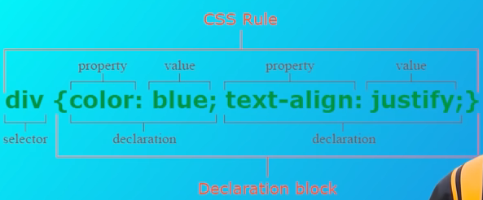
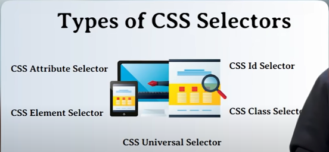
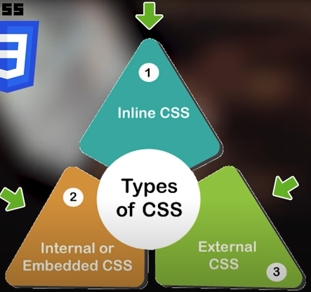
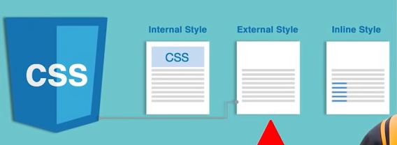

# CSS Tutorials

## CSS stands for cascading style sheet

1. html ko style kis tarah se krna (color, background, design of website).

2. in css we have to define selectors, selectors can be anything = tags, classes, ids.
and there are more selectors:-

## there are three ways to css in your page.

1. inline css = we use style atribute in html elements.
and we write css in it.
2. internal or embedded css = we write css in style tags.
3. external css = in which we mae external style sheet, with .css extension.
and with the help of link tag we link it in html page.

